# Capstone


<div align='center'>

# Auto-Code-Django

</div>
<div align="center">


[](https://hits.seeyoufarm.com)

</div>


## 목차 📝

[프로젝트 소개](#summary)
[설치 및 실행](#install)
[요구사항 분석](#requirement)
[기술 스택](#stack)
[프로젝트 구조](#tree)
[ERD 설계](#erd)
[상세 페이지 설명](#main-exe)

---

## <span id="summary"> 프로젝트 소개 🙇‍♂️

Auto-Coding은 AI가 코드를 대신 작성해 주는 서비스입니다.

유저들은 간편한 게시판을 통해 의견을 나누거나 스터디를 모집하는 등 다채로운 교류가 가능해졌습니다.

또한, 유저들은 프로필 사진과 닉네임을 통해 자신만의 독특한 개성을 표현할 수 있습니다. 

---

## <span id="install">설치 및 실행 💻

### 설치 전 요구사항
``` bash
python3 == 3.11.4
```
- 터미널에 명령어를 입력하여 실행합니다.
- 설치 및 실행을 위한 단계는 8번까지 입니다.
- 서버 중지 및 가상환경 비활성화는 9번과 10번과정 입니다.


```
1. 프로젝트 다운로드 및 폴더에 들어가기

    git clone https://github.com/omgomg333/Capstone
    cd Auto-Code-Django

2. 가상환경 생성 

    => 가상환경이름에는 유저가 원하는 이름을 입력합니다
ex) python -m venv myvenv (가상환경이름)

3. 가상환경 활성화 => 커맨드 라인 앞에 (venv)가 생성됩니다.

    # macOS
        source venv/bin/activate
    # PowerShell
        venv/Scripts/Activate.ps1

4. 의존성 설치

    pip install -r requirements.txt

5. settings.py 설정 (148, 149라인)

    EMAIL_HOST_USER 
    EMAIL_HOST_PASSWORD

    # 메일을 보내기 위한 SMTP 설정을 다시 해 줘야합니다.(원치 않으면 SMTP 관련 코드는 주석 처리)
    # 다만 주석 처리 시 비밀번호 재설정은 직접 수정해야합니다.
        

6. 데이터베이스 마이그레이션

    python manage.py makemigrations
    python manage.py migrate

    # macOS = python => python3

7. 개발 서버 실행

python manage.py runserver

8. 실행 주소

http://127.0.0.1:8000/

9. 개발 서버 중지

      # macOS
        cmd + c
      # win
        ctrl + c

10. 가상환경 비활성화

deactivate
```
---

## <span id="requirement"> 요구사항 분석 🧐

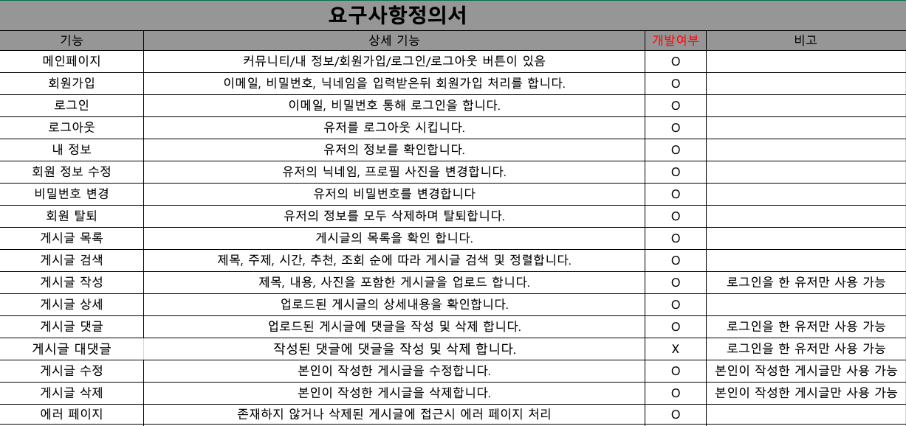


<a href='#main-exe'>기능 시연 화면</a>

---

## <span id="stack">기술 스택📚

### Environment


### Development

- #### FrontEnd


<br>

- #### BackEnd


### 배포


---

## <span id="tree">프로젝트 구조 🏛️

### URL 구조🌐


#### main
|이름|URL|Method|
|------|---|---|
|랜딩페이지|/||
|내 기록|myhitory/||

#### accounts
|이름|URL|Method|
|------|---|---|
|로그인|accounts/login/|POST|
|로그아웃|accounts/logout/|POST|
|회원가입|accounts/register/|POST|
|내 정보 조회|accounts/profile/|GET|
|내 정보수정|accounts/edit/profile/|POST|
|비밀번호 변경|accounts/password_reset/|POST|
|회원탈퇴|accounts/delete/\<int:pk>/|POST|


#### board
|이름|URL|Method|
|------|---|---|
|게시글 목록|board/\<int:pk>/|GET|
|게시글 상세|board/\<int:pk>/|GET|
|게시글 작성|board/write/|POST|
|게시글 수정|board/edit/\<int:pk>/|POST|
|게시글 삭제|board/delete/\<int:pk>/|POST|
|게시글 검색|board/?c=&q=/|GET|
|게시글 정렬|board/?s=/|GET|
|댓글 작성|board/\<int:pk>/comment/new/|POST|
|댓글 삭제|board/\<int:pk>/comment/delete/|POST|


### 폴더 트리🌳
```tree
📦 Auto-Code-Django
├─ 📂 auto_code_django  - 프로젝트의 기본적인 세팅
│  ├─ asgi.py
│  ├─ settings.py
│  ├─ urls.py
│  └─ wsgi.py
├─ 📂 accounts          -  회원관리(회원가입,로그인,로그아웃,마이페이지)기능
│  ├─ admin.py
│  ├─ apps.py
│  ├─ forms.py
│  ├─ model
│  ├─ tests.py
│  ├─ urls.py
│  └─ views.py
├─ 📂 board            - 게시판(CRUD, 조회수, 추천 등)기능
│  ├─ admin.py
│  ├─ apps.py
│  ├─ forms.py
│  ├─ models.py
│  ├─ tests.py
│  ├─ urls.py
│  └─ views.py
├─ 📂 main             - 랜딩 페이지 및 내 기록 기능
│  ├─ admin.py
│  ├─ apps.py
│  ├─ models.py
│  ├─ tests.py
│  ├─ urls.py
│  └─ views.py
├─ manage.py
├─ README.md
├─ requirements.txt
└─ 📂 templates       - 템플릿 폴더
   ├─ 403.html         
   ├─ 404.html          -- 에러처리 페이지
   ├─ 500.html         
   ├─ 📂 accounts     - 회원관리 페이지
   │  ├─ edit_profile.html
   │  ├─ login_form.html
   │  ├─ password_email_done.html
   │  ├─ password_reset.html
   │  ├─ password_reset_confirm.html
   │  ├─ password_reset_done_fail.html
   │  ├─ password_reset_form.html
   │  ├─ profile.html
   │  ├─ signup_form.html
   │  ├─ user_confirm_delete.html
   │  └─ user_delete_success.html
   ├─ base.html
   ├─ 📂 board       - 게시판 페이지
   │  ├─ popular_post_list.html
   │  ├─ post_detail.html
   │  ├─ post_form.html
   │  └─ post_list.html
   │─ 📂 main       - 랜딩 페이지 및 내 기록 페이지
      ├─ index.html
      └─ myhistory.html
  └─ 📂 static      - 정적파일
```

---

## <span id="erd"> ERD 설계 📀

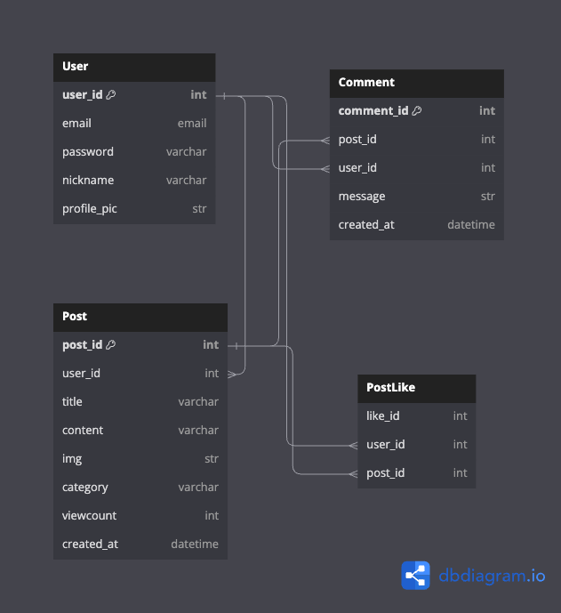

---


### 메인 페이지

|               메인 페이지               |
| :-------------------------------------: |
| 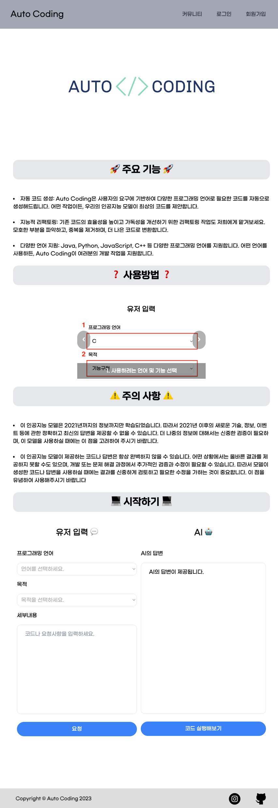  |

#### ⭐️ 커뮤니티

- 유저들이 소통을 할 수 있는 게시판 기능을 제공합니다.

#### ⭐️ 로그인, 회원가입

- 이메일과 비밀번호를 통한 회원가입 및 로그인을 할 수 있습니다.


#### ⭐️ 내 정보

- 회원가입한 유저는 회원 가입일, 최근 로그인, 작성 글 수, 작성 댓글 수를 확인할 수 있는 기능을 제공합니다.

- 닉네임을 수정할 수 있으며 프로필 사진을 설정하거나 수정할 수 있는 기능을 제공합니다.

- 이메일을 인증 통한 비밀번호 재설정을 할 수 있습니다.

<br>

### 회원관리

<br>


|                회원가입 및 로그인                |
| :-------------------------------------: |
| 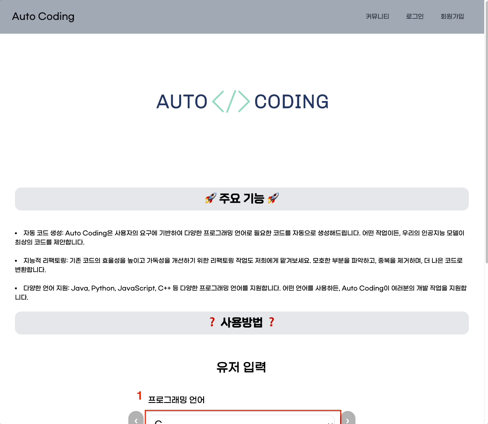 |

```
이메일과 비밀번호를 통한 회원가입 및 로그인을 할 수 있습니다.

회원가입 및 로그인 완료 시 메인페이지로 이동합니다.

```

|                로그아웃               |
| :-------------------------------------: |
| 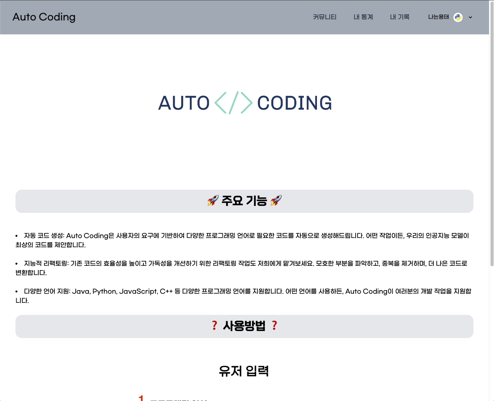 |

```
로그아웃 버튼을 통해 유저는 로그아웃을 할 수 있습니다.

로그아웃 완료 시 메인페이지로 이동합니다.

```

<br>

|                 내 정보                 |
| :-------------------------------------: |
| 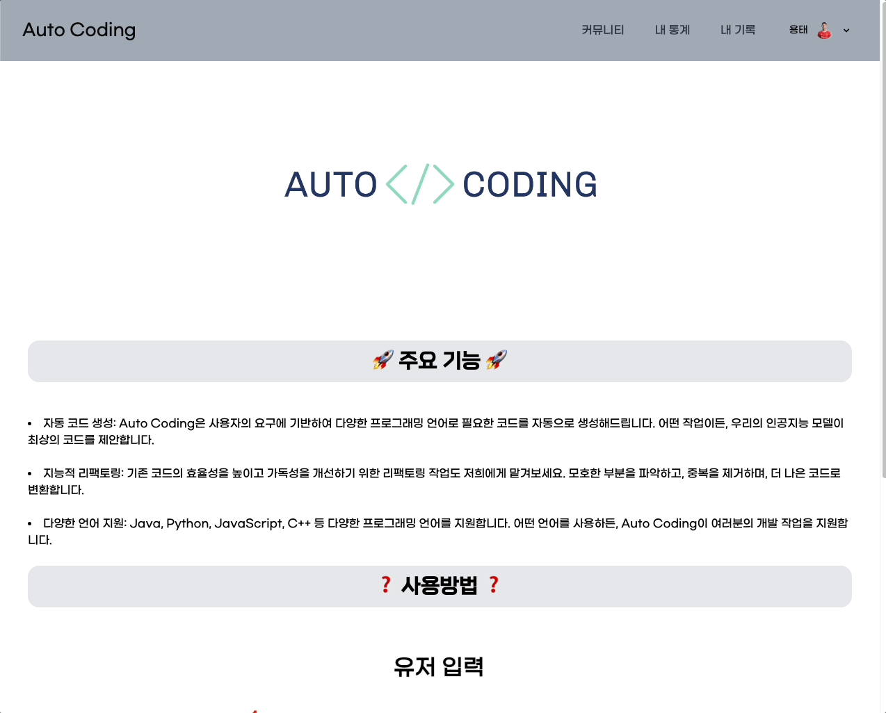  |

```
회원가입한 유저는 회원 가입일, 최근 로그인, 작성 글 수, 작성 댓글 수를 확인할 수 있는 기능을 제공합니다.

닉네임, 이메일, 프로필 사진을 확인할 수 있는 기능을 제공합니다.

유저가 작성한 글, 댓글 그리고 좋아요를 남긴 게시글을 확인할 수 있습니다.
```

<br>

|                회원 정보 수정                 |
| :-------------------------------------: |
| 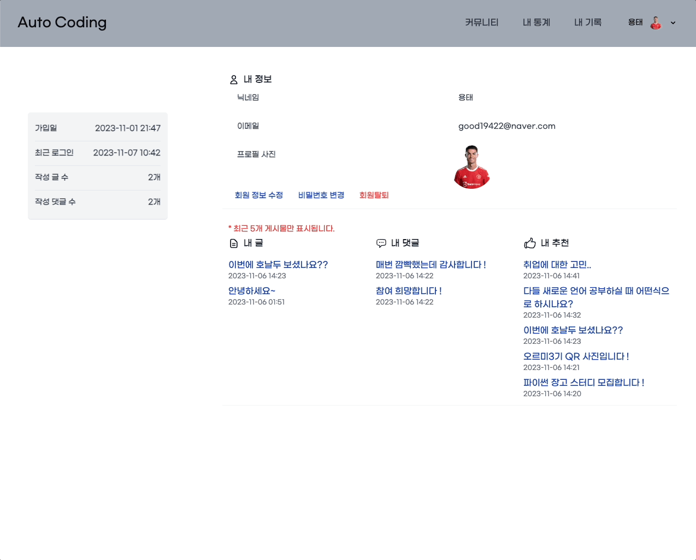 |

```
회원가입 시 작성한 닉네임을 수정할 수 있으며 프로필 사진을 설정하거나 수정할 수 있는 기능을 제공합니다.
```

<br>

|                비밀번호 변경               |
| :-------------------------------------: |
| 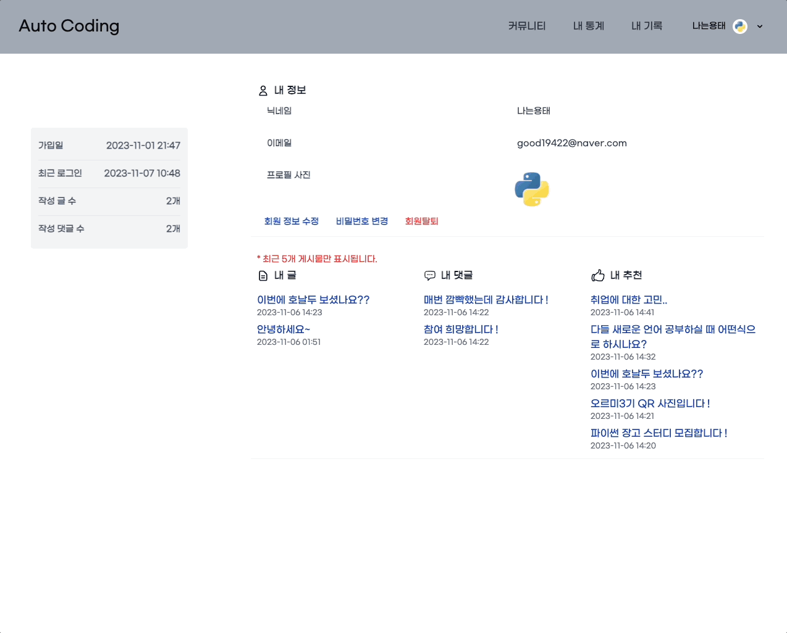 |

```
회원가입 시 작성한 이메일 인증을 통해 비밀번호를 변경할 수 있습니다.

이메일로 전송된 링크는 10분간 유효하며 10분 뒤에는 form 을 입력할 수 없습니다.

메일은 PasswordResetView, Gmail SMTP를 사용하여 발신되었습니다.
```


<br>

|                 회원 탈퇴                |
| :-------------------------------------: |
| 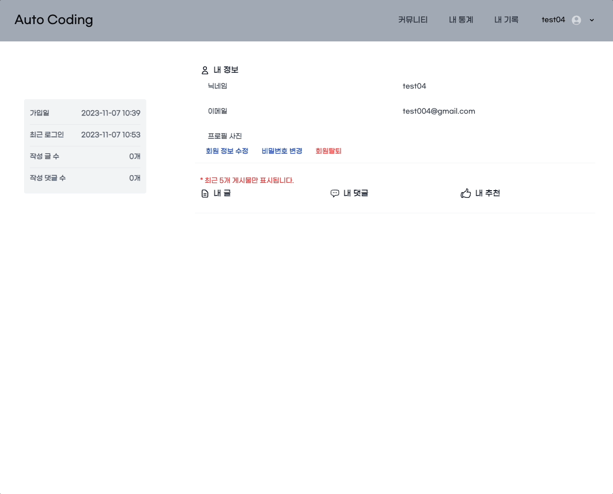 |

```
회원을 탈퇴할 수 있는 기능을 제공하며 삭제된 유저의 정보는 접근 및 복구가 불가능 합니다.

또한, 탈퇴시 유저가 작성했던 글, 댓글은 모두 삭제됩니다.

탈퇴 완료 시 메인 페이지로 이동합니다.
``` 

<br>

### 커뮤니티

<br>


|              게시글 목록 및 검색             |
| :----------------------------------: |
|  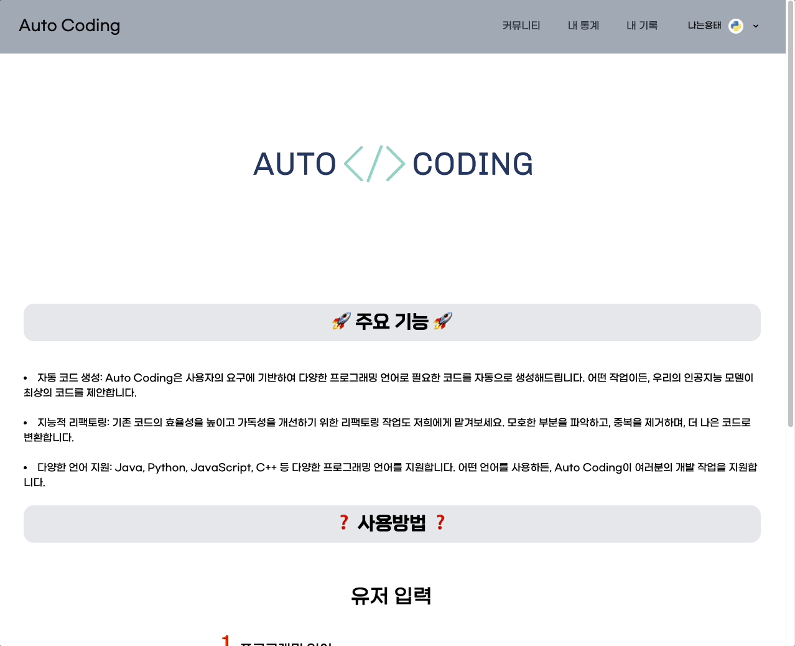 |

```
유저들은 게시판 게시글의 목록을 확인 할 수 있으며 최신 인기글 또한 확인할 수 있는 기능을 제공합니다.

주제에 따라 게시글 검색이 가능합니다.

시간순, 추천순, 조회순에 따라 게시글 정렬이 가능합니다.
```


<br>

<br>

|      게시글 작성       |
| :-------------------------------------: |
|  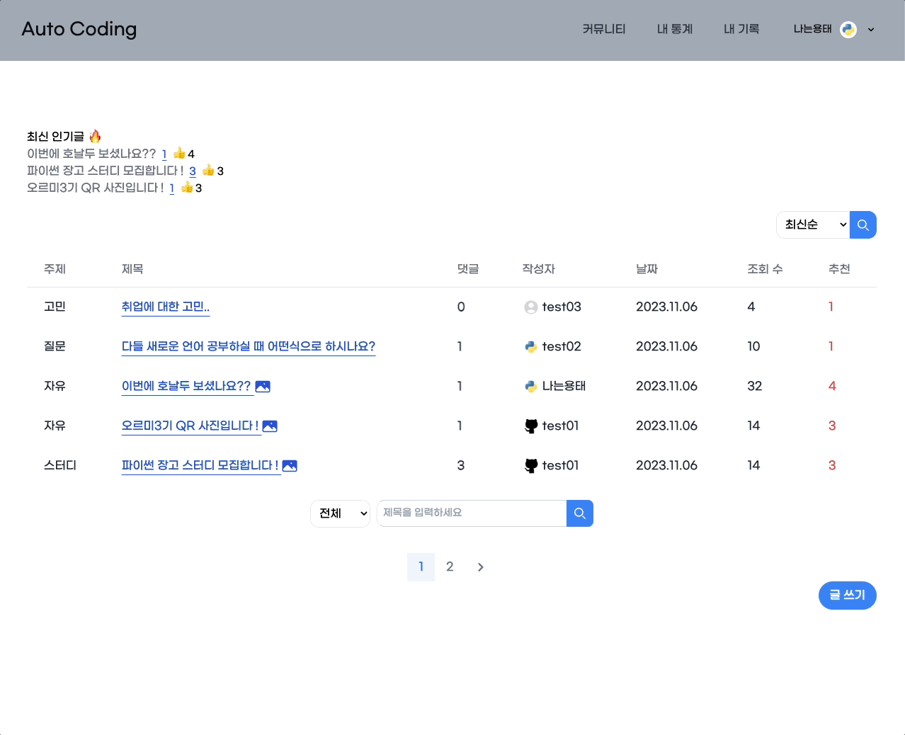 |

```
해당 기능은 제목과 내용, 사진 업로드를 제공합니다.

해당 기능은 로그인을 한 유저만 사용 가능합니다.

작성 완료 시 게시글 목록 페이지로 이동합니다.
```

<br>

|               게시글 상세                |
| :------------------------------------: |
|   |

```
유저들이 게시한 제목과 내용, 사진을 확인 할 수 있습니다.

조회수 기능을 제공하며 마음에 드는 글에 좋아요를 남길수도 있습니다.

```

<br>

|               댓글 작성 및 삭제               |
| :------------------------------------: |
|   |

```
다른 유저들과 소통이 가능하도록 댓글 작성 및 삭제 기능을 제공합니다.
```

<br>

|               게시글 수정                 |
| :------------------------------------: |
|   |

```
본인이 작성한 게시글을 수정할 수 있으며 본인 게시글이 아니면 수정이 불가능합니다.

제목과 내용은 물론 업로드한 사진 또한 수정할 수 있습니다.

수정 완료 시 게시글 목록 페이지로 이동합니다.
```

<br>

|                게시글 삭제                 |
| :------------------------------------: |
|  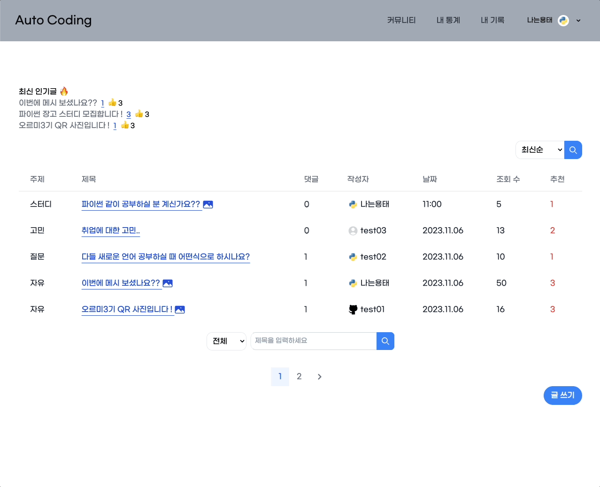 |

```
본인이 작성한 게시글을 삭제할 수 있으며 본인 게시글이 아니면 삭제가 불가능합니다.

삭제된 게시글은 접근 및 복구가 불가능 합니다.

삭제 완료 시 게시글 목록 페이지로 이동합니다.
```
<br>

|                에러 페이지                 |
| :------------------------------------: |
|  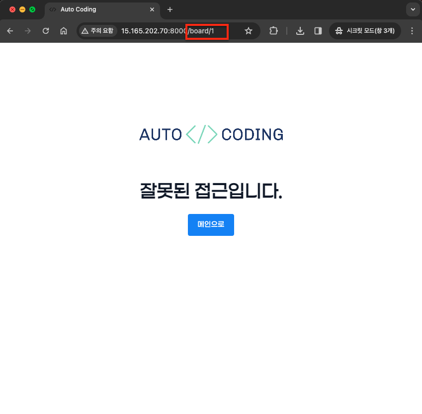 |

```
존재하지 않거나 삭제된 게시글에 접근시 잘못된 접근임을 알리는 페이지 입니다.

그 외에도 허용하지 않은 접근을 할 시 위와 같은 페이지가 나타납니다.
```
<br>

- ERD의 중요성을 경험할 수 있었습니다. 구현 시작에 급급하여 개발을 시작했는데 이로인해 개발 도중 모델을 확장하는 과정에서 발생한 에러로 인해 DB 초기화를 해야했던 경험이 있었습니다. 앞으로는 초기 기획과 ERD 작성에 충분한 시간을 투자하여 개발 단계에서의 효율성을 높일 필요성을 느꼈습니다.

---
